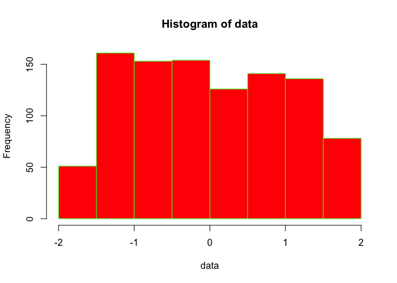

# Lecture4_Practicals
Katherine Tansey  
7/5/2017  

# Learning Objectives

* Understand the syntax of writing a function including arguments and returning      
* Learn scoping in the context of R     
* Know how to integrate functions with the apply family     
* Learn to incorporate error messages    

# What we did last time
**A LOT!!!**

Learned about the concept of tidy data and how to create it. Various ways too "look" at our data


```r
class(data)
dim(data)
colnames(data)
str(data)
glimpse(data) 
summary(data) 
head(data)
tail(data)
```

How to reshape data, going both from wide to long:


And long to wide:


How to manipulate separate one column into two:  

```r
separate(dataset1, col = chr_pos_(b36), into = c("CHR", "BP"), sep = ":")
```
Or merge multiple columns into one:

```r
unite(dataset1, ID, CHR, BP, A1, A2, sep = ":")
```
And how to alter the contains of character strings within a column:

```r
dataset1$CHR <- str_replace(dataset1$CHR, "chr", "")
```

How to quantify missingness

```r
summary(data_wide)
summary(complete.cases(data_wide))
```
And how to remove all observations with missing data from a dataset

```r
data_wide_nomissing <- data_wide[complete.cases(data_wide),]
# or 
data_wide_nomissing <- na.omit(data_wide)
```
That when using built in statistical functions to add the **na.rm=TRUE** option, otherwise if there are any missing values *NA* is returned.   

```r
mean(data_wide[,"1980"], na.rm = TRUE)
```

Various ways to join datasets together

```r
left_join(dataset1, dataset2, by = "key")
right_join(dataset1, dataset2, by = c("key1", "key2"))
inner_join(dataset1, dataset2, by = "key")
full_join(dataset1, dataset2, by = "key")
```
How to perform filtering "joins", where data is not merged together but filter based on the contents of another dataset

```r
semi_join(dataset1, dataset2, by="key")
anti_join(dataset1, dataset2, by="key")
```
To use set operations for datasets that have the exact same columns.

```r
union(dataset1, dataset2)

intersect(dataset1, dataset2)

setdiff(dataset1, dataset2)

setequal(dataset1, dataset2)
```
And binds for two datasets contain the **exact same columns** in the **exact same order**   

```r
# rows
bind_rows(dataset1, dataset2)
# columns
bind_cols(dataset1, dataset2)
```
But talked about how these can be dangerous as they do *NOTHING to match* and so *assumes there is a matching order*, which may be a big assumption!!!!    

Then we delved into dplyr, talking about the six main verbs.
1. select  -- to select columns to keep or remove 

```r
select(gapminder, country, year, lifeExp)

# vectorized
select(gapminder, country:year)

# to not select a column
select(gapminder, -country)
```

2. filter -- to select rows to keep or remove based on some criteria 

```r
# single filter
filter(gapminder, year == 1997)

# multiple filters
filter(gapminder, year == 1997 & gdpPercap > 1000)
filter(gapminder, year == 1997 | year == 1967)
```

3. arrange -- to sort columns in ascending or descending order

```r
# single parameter ascending arrange
arrange(gapminder, lifeExp)

# single parameter descending arrange
arrange(gapminder, desc(lifeExp))

# multiple parameter arrange
arrange(gapminder, desc(lifeExp), pop)
```

4. group_by -- group together observations based on information within the data

```r
# single variables
group_by(gapminder, continent)

# multiple variables
group_by(gapminder, country, continent)
```

5. summarise -- to create summary statistics

```r
summarise(gapminder, mean_lifexp = mean(lifeExp, na.rm=TRUE))

summarise(gapminder, mean_lifexp = mean(lifeExp, na.rm=TRUE), mean_gdp = mean(gdpPercap, na.rm=TRUE))
```

6. mutate -- to create new variables using existing variables

```r
# single variables
mutate(gapminder, gdp_billion=gdpPercap*pop/10^9)

#  multiple variables
mutate(dataset1, rate = NUM1/100, norm = Value2 - 50)
```

And to put them all together using the pipe operator.

```r
gapminder %>%
    group_by(country) %>%
    summarise(mean_LE = mean(lifeExp, na.rm=TRUE))
```

# What is a function?           

Have used a LOT of functions already, like built in functions:               

```r
mean()
sd()
read.table()
```

And those from packages we loaded, like:                

```r
separate()
gather()
```

R is open source, which means the code behind all functions is available to review. However, some functions (like mean, sd, and dplyr) written in C or C++ to increase speed, which are not as easy to understand/interpret

To examine what a function is doing, just type the name of the funciton without the parentheses and the code will print to the screen. You can also google to find it.  

> Examine functions


```r
read.table
```

```
## function (file, header = FALSE, sep = "", quote = "\"'", dec = ".", 
##     numerals = c("allow.loss", "warn.loss", "no.loss"), row.names, 
##     col.names, as.is = !stringsAsFactors, na.strings = "NA", 
##     colClasses = NA, nrows = -1, skip = 0, check.names = TRUE, 
##     fill = !blank.lines.skip, strip.white = FALSE, blank.lines.skip = TRUE, 
##     comment.char = "#", allowEscapes = FALSE, flush = FALSE, 
##     stringsAsFactors = default.stringsAsFactors(), fileEncoding = "", 
##     encoding = "unknown", text, skipNul = FALSE) 
## {
##     if (missing(file) && !missing(text)) {
##         file <- textConnection(text, encoding = "UTF-8")
##         encoding <- "UTF-8"
##         on.exit(close(file))
##     }
##     if (is.character(file)) {
##         file <- if (nzchar(fileEncoding)) 
##             file(file, "rt", encoding = fileEncoding)
##         else file(file, "rt")
##         on.exit(close(file))
##     }
##     if (!inherits(file, "connection")) 
##         stop("'file' must be a character string or connection")
##     if (!isOpen(file, "rt")) {
##         open(file, "rt")
##         on.exit(close(file))
##     }
##     pbEncoding <- if (encoding %in% c("", "bytes", "UTF-8")) 
##         encoding
##     else "bytes"
##     numerals <- match.arg(numerals)
##     if (skip > 0L) 
##         readLines(file, skip)
##     nlines <- n0lines <- if (nrows < 0L) 
##         5
##     else min(5L, (header + nrows))
##     lines <- .External(C_readtablehead, file, nlines, comment.char, 
##         blank.lines.skip, quote, sep, skipNul)
##     if (encoding %in% c("UTF-8", "latin1")) 
##         Encoding(lines) <- encoding
##     nlines <- length(lines)
##     if (!nlines) {
##         if (missing(col.names)) 
##             stop("no lines available in input")
##         rlabp <- FALSE
##         cols <- length(col.names)
##     }
##     else {
##         if (all(!nzchar(lines))) 
##             stop("empty beginning of file")
##         if (nlines < n0lines && file == 0L) {
##             pushBack(c(lines, lines, ""), file, encoding = pbEncoding)
##             on.exit((clearPushBack(stdin())))
##         }
##         else pushBack(c(lines, lines), file, encoding = pbEncoding)
##         first <- scan(file, what = "", sep = sep, quote = quote, 
##             nlines = 1, quiet = TRUE, skip = 0, strip.white = TRUE, 
##             blank.lines.skip = blank.lines.skip, comment.char = comment.char, 
##             allowEscapes = allowEscapes, encoding = encoding, 
##             skipNul = skipNul)
##         col1 <- if (missing(col.names)) 
##             length(first)
##         else length(col.names)
##         col <- numeric(nlines - 1L)
##         if (nlines > 1L) 
##             for (i in seq_along(col)) col[i] <- length(scan(file, 
##                 what = "", sep = sep, quote = quote, nlines = 1, 
##                 quiet = TRUE, skip = 0, strip.white = strip.white, 
##                 blank.lines.skip = blank.lines.skip, comment.char = comment.char, 
##                 allowEscapes = allowEscapes, encoding = encoding, 
##                 skipNul = skipNul))
##         cols <- max(col1, col)
##         rlabp <- (cols - col1) == 1L
##         if (rlabp && missing(header)) 
##             header <- TRUE
##         if (!header) 
##             rlabp <- FALSE
##         if (header) {
##             .External(C_readtablehead, file, 1L, comment.char, 
##                 blank.lines.skip, quote, sep, skipNul)
##             if (missing(col.names)) 
##                 col.names <- first
##             else if (length(first) != length(col.names)) 
##                 warning("header and 'col.names' are of different lengths")
##         }
##         else if (missing(col.names)) 
##             col.names <- paste0("V", 1L:cols)
##         if (length(col.names) + rlabp < cols) 
##             stop("more columns than column names")
##         if (fill && length(col.names) > cols) 
##             cols <- length(col.names)
##         if (!fill && cols > 0L && length(col.names) > cols) 
##             stop("more column names than columns")
##         if (cols == 0L) 
##             stop("first five rows are empty: giving up")
##     }
##     if (check.names) 
##         col.names <- make.names(col.names, unique = TRUE)
##     if (rlabp) 
##         col.names <- c("row.names", col.names)
##     nmColClasses <- names(colClasses)
##     if (is.null(nmColClasses)) {
##         if (length(colClasses) < cols) 
##             colClasses <- rep_len(colClasses, cols)
##     }
##     else {
##         tmp <- rep_len(NA_character_, cols)
##         names(tmp) <- col.names
##         i <- match(nmColClasses, col.names, 0L)
##         if (any(i <= 0L)) 
##             warning("not all columns named in 'colClasses' exist")
##         tmp[i[i > 0L]] <- colClasses[i > 0L]
##         colClasses <- tmp
##     }
##     what <- rep.int(list(""), cols)
##     names(what) <- col.names
##     colClasses[colClasses %in% c("real", "double")] <- "numeric"
##     known <- colClasses %in% c("logical", "integer", "numeric", 
##         "complex", "character", "raw")
##     what[known] <- sapply(colClasses[known], do.call, list(0))
##     what[colClasses %in% "NULL"] <- list(NULL)
##     keep <- !sapply(what, is.null)
##     data <- scan(file = file, what = what, sep = sep, quote = quote, 
##         dec = dec, nmax = nrows, skip = 0, na.strings = na.strings, 
##         quiet = TRUE, fill = fill, strip.white = strip.white, 
##         blank.lines.skip = blank.lines.skip, multi.line = FALSE, 
##         comment.char = comment.char, allowEscapes = allowEscapes, 
##         flush = flush, encoding = encoding, skipNul = skipNul)
##     nlines <- length(data[[which.max(keep)]])
##     if (cols != length(data)) {
##         warning("cols = ", cols, " != length(data) = ", length(data), 
##             domain = NA)
##         cols <- length(data)
##     }
##     if (is.logical(as.is)) {
##         as.is <- rep_len(as.is, cols)
##     }
##     else if (is.numeric(as.is)) {
##         if (any(as.is < 1 | as.is > cols)) 
##             stop("invalid numeric 'as.is' expression")
##         i <- rep.int(FALSE, cols)
##         i[as.is] <- TRUE
##         as.is <- i
##     }
##     else if (is.character(as.is)) {
##         i <- match(as.is, col.names, 0L)
##         if (any(i <= 0L)) 
##             warning("not all columns named in 'as.is' exist")
##         i <- i[i > 0L]
##         as.is <- rep.int(FALSE, cols)
##         as.is[i] <- TRUE
##     }
##     else if (length(as.is) != cols) 
##         stop(gettextf("'as.is' has the wrong length %d  != cols = %d", 
##             length(as.is), cols), domain = NA)
##     do <- keep & !known
##     if (rlabp) 
##         do[1L] <- FALSE
##     for (i in (1L:cols)[do]) {
##         data[[i]] <- if (is.na(colClasses[i])) 
##             type.convert(data[[i]], as.is = as.is[i], dec = dec, 
##                 numerals = numerals, na.strings = character(0L))
##         else if (colClasses[i] == "factor") 
##             as.factor(data[[i]])
##         else if (colClasses[i] == "Date") 
##             as.Date(data[[i]])
##         else if (colClasses[i] == "POSIXct") 
##             as.POSIXct(data[[i]])
##         else methods::as(data[[i]], colClasses[i])
##     }
##     compactRN <- TRUE
##     if (missing(row.names)) {
##         if (rlabp) {
##             row.names <- data[[1L]]
##             data <- data[-1L]
##             keep <- keep[-1L]
##             compactRN <- FALSE
##         }
##         else row.names <- .set_row_names(as.integer(nlines))
##     }
##     else if (is.null(row.names)) {
##         row.names <- .set_row_names(as.integer(nlines))
##     }
##     else if (is.character(row.names)) {
##         compactRN <- FALSE
##         if (length(row.names) == 1L) {
##             rowvar <- (1L:cols)[match(col.names, row.names, 0L) == 
##                 1L]
##             row.names <- data[[rowvar]]
##             data <- data[-rowvar]
##             keep <- keep[-rowvar]
##         }
##     }
##     else if (is.numeric(row.names) && length(row.names) == 1L) {
##         compactRN <- FALSE
##         rlabp <- row.names
##         row.names <- data[[rlabp]]
##         data <- data[-rlabp]
##         keep <- keep[-rlabp]
##     }
##     else stop("invalid 'row.names' specification")
##     data <- data[keep]
##     if (is.object(row.names) || !(is.integer(row.names))) 
##         row.names <- as.character(row.names)
##     if (!compactRN) {
##         if (length(row.names) != nlines) 
##             stop("invalid 'row.names' length")
##         if (anyDuplicated(row.names)) 
##             stop("duplicate 'row.names' are not allowed")
##         if (anyNA(row.names)) 
##             stop("missing values in 'row.names' are not allowed")
##     }
##     class(data) <- "data.frame"
##     attr(data, "row.names") <- row.names
##     data
## }
## <bytecode: 0x7fc8c4f48600>
## <environment: namespace:utils>
```

Compare this to the output of those functions I said were written in C/C++

```r
mean
```

```
## function (x, ...) 
## UseMethod("mean")
## <bytecode: 0x7fc8c3d2f708>
## <environment: namespace:base>
```
Or:    

```r
library(dplyr)
```

```r
arrange
```

```
## function (.data, ...) 
## {
##     UseMethod("arrange")
## }
## <environment: namespace:dplyr>
```

Let's look at another function. Within the **pwr** package in R, let's examine the code to calculate power for a t-test.    

```r
library(pwr)
```

```r
pwr.t.test 
```

```
## function (n = NULL, d = NULL, sig.level = 0.05, power = NULL, 
##     type = c("two.sample", "one.sample", "paired"), alternative = c("two.sided", 
##         "less", "greater")) 
## {
##     if (sum(sapply(list(n, d, power, sig.level), is.null)) != 
##         1) 
##         stop("exactly one of n, d, power, and sig.level must be NULL")
##     if (!is.null(sig.level) && !is.numeric(sig.level) || any(0 > 
##         sig.level | sig.level > 1)) 
##         stop(sQuote("sig.level"), " must be numeric in [0, 1]")
##     if (!is.null(power) && !is.numeric(power) || any(0 > power | 
##         power > 1)) 
##         stop(sQuote("power"), " must be numeric in [0, 1]")
##     type <- match.arg(type)
##     alternative <- match.arg(alternative)
##     tsample <- switch(type, one.sample = 1, two.sample = 2, paired = 1)
##     ttside <- switch(alternative, less = 1, two.sided = 2, greater = 3)
##     tside <- switch(alternative, less = 1, two.sided = 2, greater = 1)
##     if (tside == 2 && !is.null(d)) 
##         d <- abs(d)
##     if (ttside == 1) {
##         p.body <- quote({
##             nu <- (n - 1) * tsample
##             pt(qt(sig.level/tside, nu, lower = TRUE), nu, ncp = sqrt(n/tsample) * 
##                 d, lower = TRUE)
##         })
##     }
##     if (ttside == 2) {
##         p.body <- quote({
##             nu <- (n - 1) * tsample
##             qu <- qt(sig.level/tside, nu, lower = FALSE)
##             pt(qu, nu, ncp = sqrt(n/tsample) * d, lower = FALSE) + 
##                 pt(-qu, nu, ncp = sqrt(n/tsample) * d, lower = TRUE)
##         })
##     }
##     if (ttside == 3) {
##         p.body <- quote({
##             nu <- (n - 1) * tsample
##             pt(qt(sig.level/tside, nu, lower = FALSE), nu, ncp = sqrt(n/tsample) * 
##                 d, lower = FALSE)
##         })
##     }
##     if (is.null(power)) 
##         power <- eval(p.body)
##     else if (is.null(n)) 
##         n <- uniroot(function(n) eval(p.body) - power, c(2 + 
##             1e-10, 1e+09))$root
##     else if (is.null(d)) {
##         if (ttside == 2) {
##             d <- uniroot(function(d) eval(p.body) - power, c(1e-07, 
##                 10))$root
##         }
##         if (ttside == 1) {
##             d <- uniroot(function(d) eval(p.body) - power, c(-10, 
##                 5))$root
##         }
##         if (ttside == 3) {
##             d <- uniroot(function(d) eval(p.body) - power, c(-5, 
##                 10))$root
##         }
##     }
##     else if (is.null(sig.level)) 
##         sig.level <- uniroot(function(sig.level) eval(p.body) - 
##             power, c(1e-10, 1 - 1e-10))$root
##     else stop("internal error")
##     NOTE <- switch(type, paired = "n is number of *pairs*", two.sample = "n is number in *each* group", 
##         NULL)
##     METHOD <- paste(switch(type, one.sample = "One-sample", two.sample = "Two-sample", 
##         paired = "Paired"), "t test power calculation")
##     structure(list(n = n, d = d, sig.level = sig.level, power = power, 
##         alternative = alternative, note = NOTE, method = METHOD), 
##         class = "power.htest")
## }
## <environment: namespace:pwr>
```

Functions are incredibly useful if you are doing the same thing over and over and over again. Copying and pasting can go wrong, it is better to make a function to perform the repetitive task for you. 

## Functions can be treated like other R objects     

* Assign functions to variables      
* Store functions in lists       
* Pass functions as arguments to other functions        
* Create functions inside functions         
* Return functions as the result of a function          

# How to write a function
There are 3 main components to creating a function. 

1. Function name
    + What you are going to call your function
    + Logical, relevant, descriptive 
    + Do **NOT** name your function after a base utility in R
2. Inputs or arguments
    + Data the function is going to manipulate
    + Options for the function
3. Code body
    + Code developed that performs a function


> Examine pwr.t.test


```r
library(pwr)
```

```r
pwr.t.test 
```

```
## function (n = NULL, d = NULL, sig.level = 0.05, power = NULL, 
##     type = c("two.sample", "one.sample", "paired"), alternative = c("two.sided", 
##         "less", "greater")) 
## {
##     if (sum(sapply(list(n, d, power, sig.level), is.null)) != 
##         1) 
##         stop("exactly one of n, d, power, and sig.level must be NULL")
##     if (!is.null(sig.level) && !is.numeric(sig.level) || any(0 > 
##         sig.level | sig.level > 1)) 
##         stop(sQuote("sig.level"), " must be numeric in [0, 1]")
##     if (!is.null(power) && !is.numeric(power) || any(0 > power | 
##         power > 1)) 
##         stop(sQuote("power"), " must be numeric in [0, 1]")
##     type <- match.arg(type)
##     alternative <- match.arg(alternative)
##     tsample <- switch(type, one.sample = 1, two.sample = 2, paired = 1)
##     ttside <- switch(alternative, less = 1, two.sided = 2, greater = 3)
##     tside <- switch(alternative, less = 1, two.sided = 2, greater = 1)
##     if (tside == 2 && !is.null(d)) 
##         d <- abs(d)
##     if (ttside == 1) {
##         p.body <- quote({
##             nu <- (n - 1) * tsample
##             pt(qt(sig.level/tside, nu, lower = TRUE), nu, ncp = sqrt(n/tsample) * 
##                 d, lower = TRUE)
##         })
##     }
##     if (ttside == 2) {
##         p.body <- quote({
##             nu <- (n - 1) * tsample
##             qu <- qt(sig.level/tside, nu, lower = FALSE)
##             pt(qu, nu, ncp = sqrt(n/tsample) * d, lower = FALSE) + 
##                 pt(-qu, nu, ncp = sqrt(n/tsample) * d, lower = TRUE)
##         })
##     }
##     if (ttside == 3) {
##         p.body <- quote({
##             nu <- (n - 1) * tsample
##             pt(qt(sig.level/tside, nu, lower = FALSE), nu, ncp = sqrt(n/tsample) * 
##                 d, lower = FALSE)
##         })
##     }
##     if (is.null(power)) 
##         power <- eval(p.body)
##     else if (is.null(n)) 
##         n <- uniroot(function(n) eval(p.body) - power, c(2 + 
##             1e-10, 1e+09))$root
##     else if (is.null(d)) {
##         if (ttside == 2) {
##             d <- uniroot(function(d) eval(p.body) - power, c(1e-07, 
##                 10))$root
##         }
##         if (ttside == 1) {
##             d <- uniroot(function(d) eval(p.body) - power, c(-10, 
##                 5))$root
##         }
##         if (ttside == 3) {
##             d <- uniroot(function(d) eval(p.body) - power, c(-5, 
##                 10))$root
##         }
##     }
##     else if (is.null(sig.level)) 
##         sig.level <- uniroot(function(sig.level) eval(p.body) - 
##             power, c(1e-10, 1 - 1e-10))$root
##     else stop("internal error")
##     NOTE <- switch(type, paired = "n is number of *pairs*", two.sample = "n is number in *each* group", 
##         NULL)
##     METHOD <- paste(switch(type, one.sample = "One-sample", two.sample = "Two-sample", 
##         paired = "Paired"), "t test power calculation")
##     structure(list(n = n, d = d, sig.level = sig.level, power = power, 
##         alternative = alternative, note = NOTE, method = METHOD), 
##         class = "power.htest")
## }
## <environment: namespace:pwr>
```

## Starting example


```r
# Create a dummy dataset of 1000 observations of 10 variables
data1 <- data.frame(replicate(10,sample(0:100,1000,rep=TRUE)))
summary(data1)
```

```
##        X1               X2               X3               X4        
##  Min.   :  0.00   Min.   :  0.00   Min.   :  0.00   Min.   :  0.00  
##  1st Qu.: 23.00   1st Qu.: 24.00   1st Qu.: 25.00   1st Qu.: 25.00  
##  Median : 48.00   Median : 50.00   Median : 48.50   Median : 50.00  
##  Mean   : 49.06   Mean   : 50.16   Mean   : 49.77   Mean   : 49.76  
##  3rd Qu.: 74.00   3rd Qu.: 77.00   3rd Qu.: 75.00   3rd Qu.: 73.00  
##  Max.   :100.00   Max.   :100.00   Max.   :100.00   Max.   :100.00  
##        X5               X6               X7               X8        
##  Min.   :  0.00   Min.   :  0.00   Min.   :  0.00   Min.   :  0.00  
##  1st Qu.: 27.00   1st Qu.: 25.00   1st Qu.: 25.00   1st Qu.: 24.00  
##  Median : 53.00   Median : 51.00   Median : 50.00   Median : 49.00  
##  Mean   : 51.87   Mean   : 50.69   Mean   : 50.91   Mean   : 49.49  
##  3rd Qu.: 78.00   3rd Qu.: 76.00   3rd Qu.: 76.00   3rd Qu.: 74.25  
##  Max.   :100.00   Max.   :100.00   Max.   :100.00   Max.   :100.00  
##        X9              X10        
##  Min.   :  0.00   Min.   :  0.00  
##  1st Qu.: 25.00   1st Qu.: 23.00  
##  Median : 50.50   Median : 49.00  
##  Mean   : 50.29   Mean   : 49.11  
##  3rd Qu.: 76.00   3rd Qu.: 74.25  
##  Max.   :100.00   Max.   :100.00
```
This code below will work but has errors in it

```r
# recode the variables to create standardized values (z-scores)
data1$var1 <- (data1$var1 - mean(data1$var1)) / sd(data1$var1)
data1$var2 <- (data1$var2 - mean(data1$var2)) / sd(data1$var2)
data1$var3 <- (data1$var3 - mean(data1$var3)) / sd(data1$var3)
data1$var4 <- (data1$var4 - mean(data1$var3)) / sd(data1$var4)
data1$var5 <- (data1$var5 - mean(data1$var5)) / sd(data1$var5)
data1$var6 <- (data1$var6 - mean(data1$var6)) / sd(data1$var6)
data1$var7 <- (data1$var7 - mean(data1$var7)) / sd(data1$var7)
data1$var8 <- (data1$var8 - mean(data1$var7)) / sd(data1$var8)
data1$var9 <- (data1$var9 - mean(data1$var8)) / sd(data1$var9)
data1$var10 <- (data1$var10 - mean(data1$var10)) / sd(data1$var10)
```
All of those lines of code can be replaced with:

```r
z_score <- function(x) {
    zscore <- (x - mean(x)) / sd(x)
    zscore
}
data1[] <- lapply(data1, z_score)
```
**What is the lapply function doing here?**

> Lets make some functions

Create a function that calculates BMI.  BMI metric values, meaning weight is in kilograms and height is in meters. 

```
```


Look [here](http://www.diabetes.co.uk/bmi.html) to see BMI classifications (i.e. normal, overweight, obese, etc)


# Arguments 

Two ways to refer to arguments when calling functions. 

```r
# generic function
add_numbers <- function(x, y) {
	result <- x + y
	result
}
```
1. Rely on positions for matching
    + If not in correct order, arguments will be mis-assigned!

```r
add_numbers(2, 6)
```

```
## [1] 8
```
2.  Matching on name 
    + Position not longer matters

```r
add_numbers(y = 2, x = 6)
```

```
## [1] 8
```

> Different ways to call arguments

Using your previously made BMI function, refer to the arguments in the function using the two different methods.

```
```


Argument names should be logical, relevant and descriptive. R does not care what you name it (outside of R's usual requirements like **can not** contain spaces or special characters or start with a number).

Some commonly used names that have meaning:    

* x, y, z: vectors      
* w: a vector of weights       
* df: a data frame       
* i, j: numeric indices   (typically i is rows and j is columns)         
* n: length, or number of rows       
* p: number of columns       


## Default arguments 

Arguments can have a default value. This means for something like read.table, which has a lot of arguments, not every argument needs to be set in order for the function to run without error as they have default values. 

Defaults are very useful:    

* Assume a common occurrence          
* Means with large number of arguments NOT ALL have to be specified            
* Reduces typing and ERRORs            


```r
read.table(file, header = FALSE, sep = "", quote = "\"'", dec = ".", …)
```
We have worked with defaults before, when importing data into R. We had to change the header and sep commands in order to get data to read in correctly.      

For example in read.table, you do not specify a value for the argument header, the default value (FALSE meaning there is no header) is used. However, if you do have a header row, than the default needs to be over written by added the *header = TRUE* argument into the call of the function.       

Let's re-examine our z-score function from before:

```r
z_score <- function(x) {
	zscore <- (x - mean(x)) / sd(x)
	zscore 
}
```
**Is there an obvious default we could add here to make this function more robust?**       


```r
z_score <- function(x,missing=TRUE) {
	zscore <- (x - mean(x, na.rm=missing)) / sd(x, na.rm=missing)
	zscore 
}
```
By adding missing = TRUE as a default, we can make this function more robust to the effects of missing data in datasets. This way z-scores are still calculated even if these is missing data (remember that even having 1 NA value in a column means that these functions will return NA and not the mean or sd).    

Test this out using this dataset which includes missing data.

```r
df <- data.frame(A = 1:10, B = 11:20, c = 21:30)
df <- as.data.frame(lapply(df, function(cc) cc[ sample(c(TRUE, NA), 
                                                       prob = c(0.85, 0.15), 
                                                       size = length(cc), 
                                                       replace = TRUE) ]))
z_score <- function(x,missing=TRUE) {
    zscore <- (x - mean(x, na.rm=missing)) / sd(x, na.rm=missing)
}
df1 <- apply(df, 2, z_score)
```

> Work with setting defaults

What is a potential default that could be added to the BMI calculator to improve it? Think about how we calculate BMI, that the values *MUST* be in metric format?


```
```


## Ellipsis
Increase flexiblity in function inputs as you do not have to list all the inputs for built in commands. The ellipsis allows for inputs to get "passed down", thefore you don’t have to write explictly for every single input if using default commands.


```r
make_histogram <- function(data, color, ...) { 
	hist(data, col=color, ...)
}
make_histogram(data1[,1], "red", breaks=10, border = "green")
```

<!-- -->

> Practice ellipsis

Look at the [hist](https://stat.ethz.ch/R-manual/R-devel/library/graphics/html/hist.html) function. Alter the command above to create more bars (bars with a smaller width), with blue bars, and altered the x-axis label to read "Distribution"

```
```


# Returning 
Due to scoping (talked about below), variable defined in fucntion will not be returned without explicitly doing so.  All function will return the last line if that is not assigning a variable.             

Use  **return()** to be explicit about what is returned.


```r
add_numbers <- function(x, y) {
	result <- x + y
}
add_numbers(2,6)
```


```r
add_numbers <- function(x, y) {
	x + y
}
add_numbers(2,6)
```

```
## [1] 8
```


```r
add_numbers <- function(x, y) {
	result <- x + y
	result
}
add_numbers(2,6)
```

```
## [1] 8
```


```r
add_numbers <- function(x, y) {
	result <- x + y
	return(result)
}
add_numbers(2,6)
```

```
## [1] 8
```

**What will this return?**  

```r
add_numbers <- function(x, y) {
	result <- x + y
}
test <- add_numbers(2,6)
```

> Returns 

Alter the bmi function to explicitly return items. 

```
```


# Scoping
Scoping refers to how R looks up values by name.       

 

A function is its own working environment with R. R first looks within the function for objects/information (if you are running a function). If it does not find what it is looking for within the function environment, R then looks one level up in the script environment. If it does not find it there, it looks in the R or Global environment which includes base R and all the R packages you have loaded for that session. Variables not returned not accessible outside the function, they are not listed in the Global environment as variables (in the upper right hand window in RStudio called environment).                      


```r
y <- 400
add_squared_numbers <- function(x) {
    z <- x * x
    a <- y * y
    z + a
}

add_squared_numbers(6)
```

```
## [1] 160036
```

```r
print(c(z, a))
```

```
## Error in print(c(z, a)): object 'z' not found
```
The call **print(z, a)** throws an error. This is because these variables only exist within the environment of the function and are not returned to the global/R environment. Therefore they do not exist to be printed outside of the function. 

However, if we were to call print within the function, we are able to access the variables z and a, the print function no longer throws an error. 

```r
y <- 400
add_squared_numbers <- function(x) {
    z <- x * x
    a <- y * y
    print(c(z, a))
    z + a
}

add_squared_numbers(6)
```

```
## [1]     36 160000
```

```
## [1] 160036
```

> See how scoping works

Alter the BMI calculator to take imperial measurements as well as metric. Imperial measurements will give height in inches and weight in pounds. Within the funciton convert the imperial measurements to metric to calculate BMI. 1 inches is 0.0254 meters, and 1 pound is 0.453592 kilograms.  You should be creating a conditional statement that does two different calculations, and you should be creating intermediate variable for the height/weight conversion.

Attempt to acces height and weight outside of the function. 

```
```


What happens if you call the bmi statement like this?

```r
height = 88
weight = 123
bmi_calc( values = "metric")
```

```
## Error in eval(expr, envir, enclos): could not find function "bmi_calc"
```
**Why does the above throw an error but the below does not?**

```r
y <- 400
add_squared_numbers <- function(x) {
    z <- x * x
    a <- y * y
    print(c(z, a))
    z + a
}

add_squared_numbers(6)
```

```
## [1]     36 160000
```

```
## [1] 160036
```

Functions should **NEVER** depend on variables other than the arguments.        

This is why the bmi_calc gives an error, because the arguments (height and weight) must be called with the function, however add_squared_numbers doesn't have y as an input argument, therefore R goes looking for it (first within the function and then in the wider environment).     

# Revisiting the apply family

Anonymous functions do not have names. They are written on one line with the function wrapped in parentheses. 

```r
(function(x) cody_body) (input)
```

```r
(function(x,y) x + y)(2,6)
```

```
## [1] 8
```
These are most useful when intergrated into the apply family of functions. Otherwise, if you find yourself in need of a function, I would suggest written a named function.   

```r
apply(mtcars, 2, function(x) length(unique(x)))
```

```
##  mpg  cyl disp   hp drat   wt qsec   vs   am gear carb 
##   25    3   27   22   22   29   30    2    2    3    6
```
NOTE: that when using anonymous functions within the apply functions, they are not wrapped in parenthesis (), but they can be wrapped in parenthesis without throwing an error        

```r
apply(mtcars, 2, (function(x) length(unique(x))))
```

```
##  mpg  cyl disp   hp drat   wt qsec   vs   am gear carb 
##   25    3   27   22   22   29   30    2    2    3    6
```


```r
apply(iris[,1:4], 2, function(x) length(x[x>7]))
```

```
## Sepal.Length  Sepal.Width Petal.Length  Petal.Width 
##           12            0            0            0
```

```r
apply(iris[,1:4], 2, function(x) mean(x[x>0]))
```

```
## Sepal.Length  Sepal.Width Petal.Length  Petal.Width 
##     5.843333     3.057333     3.758000     1.199333
```


```r
# Create a dummy dataset of 1000 observations of 10 variables
data1 <- data.frame(replicate(10,sample(0:100,1000,rep=TRUE)))

z_score <- function(x) {
	zscore <- (x - mean(x)) / sd(x)
	zscore
}

data2 <- apply(data1, 2, z_score)
```

> Integrate own functions into the apply family

Use data from the US National Health Interview Survey (NHIS 2007 data.csv) in Lecture4_data. Load data into R and use the mapply function and your own bmi function to create a new column called bmi_new.

```
```


How do your results compare with those results in the file?       

# Calling functions from other scripts
Good project management suggests that you "Separate function definition and application", which means to pull out functions for code and save them in a central location. This can increase the reuse of functions and saves re-writing what you have already written!      


> Used a called function

In Lecture4_data there is an R script called "genome_power_analysis.R" that contains function for calculating power for a single variant genetic analysis assuming an additive model using a quantitative trait.  Open that script and get familiar with the syntax of the function.

Call that function from this script. 

Calculate power for a variant with MAF of 0.01 and an effect size of 1.01 in a sample of 1000 people with the alpha level of 0.00000005 (genome wide significance threshold)

```
```


Calculate power for a variant with MAF of 0.05 and an effect size of 1.01 in a sample of 1000 people with the alpha level of 0.00000005 (genome wide significance threshold)

```
```


# Getting fancier	
Integrate in checks to ensure inputs are the correct type/format. Set pre-condition that inputs must meet before function runs. This allows the writer to write informative and meaningful errors messages to the user (this is really helpful!). *Better error messages enable the person using your code to know where they went wrong*, and how they can fix it!     
 
Some examples

**stop()** -> used with an if statement
if checks a condition, and stop outputs the error message if condition meet

```r
add_squared_numbers <- function(x,y) {
    if (is.numeric(x) == FALSE | is.numeric(y) == FALSE) {
        stop("'x' and 'y' must be numbers", call.=FALSE)
    }
    z <- x * x
    a <- y * y
    z + a
}
add_squared_numbers("dog" ,10)
```

```
## Error: 'x' and 'y' must be numbers
```

**stopifnot()** -> checks every argument is true

```r
add_squared_numbers <- function(x,y) {
    stopifnot(is.numeric(x)  & is.numeric(y))
    z <- x * x
    a <- y * y
    z + a
}
add_squared_numbers("6",10)
```

```
## Error: is.numeric(x) & is.numeric(y) is not TRUE
```


```r
add_squared_numbers <- function(x,y) {
    stopifnot(is.numeric(x)  & is.numeric(y))
    z <- x * x
    a <- y * y
    z + a
}
try(add_squared_numbers("6",10))
```

There are other types of warning messages that can be include like:

* warning
    + Difference warnings do not kill the function
    + Function will run to completion and output result as well as the warning
* assert_that 
    + From *assertthat* package 
    + Works like *stopifnot*
    + Assert that x is a character, or a certain length, etc…

# For practice:
Update the BMI function to output the category someone is in (i.e. underweight, healthy weight, overweight, obese, etc.) given their BMI. 


# Wrapping Up
## Key Points
* Write a function if you have copied and pasted more than twice!
* Functions are like any other object in R
* Functions should **NEVER** depend on variables other than the arguments
    + Because of the effect of lexical scoping in R
* Arguments can have defaults
* Use **return()** to return information from faction 
* Create highly reusable functions by pulling them out of code and saving them as separate files
    + Use **source(/path_to_ function/function.R)** to call function from script 
* Use checks to ensure good inputs

## Good tips for function writing          

* Not too long       
* Do a single operation       

* Function name are relevant, logical and descriptive           
    + Same for arguments!          
* Most used arguments (like data) are first         
* Less used arguments are toward the end         
    + Give them defaults!           
* It is obvious what is being returned           

## Further Reading 
From Hadley Wickham’s Advanced R:

* [Functions](http://adv-r.had.co.nz/Functions.html)          
* [Functionals](http://adv-r.had.co.nz/Functionals.html)         
* [Functional programming](http://adv-r.had.co.nz/Functional-programming.html)    
* [Exception Debugging](http://adv-r.had.co.nz/Exceptions-Debugging.html)         


