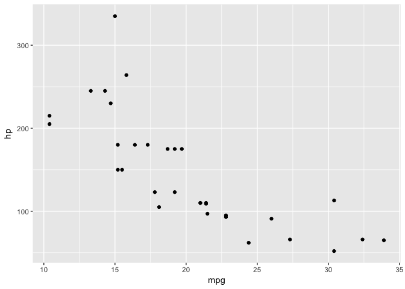
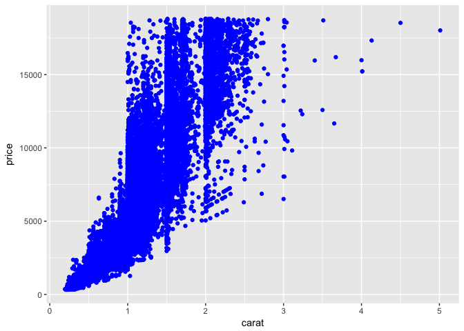
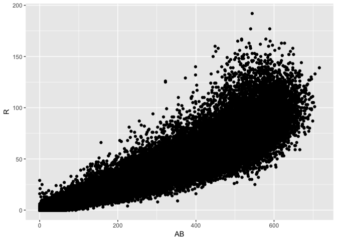

# Lecture5_Practicals
Katherine Tansey  
7/7/2017  

# Learning Objectives

* Comprehend why plotting data is important
* Know how human perception changes interpretation of graphics 
* Get familiar with the syntax of ggplot2 R package
* Understand which plot type to create arises from the data

# What we did last time
Learned about the format of functions

```r
function_name <- function(arg1, arg2, arg3) {
    code_body
}
```

Saw two ways to call function arguments:

```r
# generic function
add_numbers <- function(x, y) {
    result <- x + y
    result
}
add_numbers(2, 6)
add_numbers(y = 2, x = 6)
```

Learned it is best to set defaults for arguments, especially those with a lot of arguments, so that not every argument needs to be set in order for the function to run without error.

```r
z_score <- function(x,missing=TRUE) {
    zscore <- (x - mean(x, na.rm=missing)) / sd(x, na.rm=missing)
    zscore 
}
```

Used the ellipsis as a function argument to increase flexiblity allowing for inputs to get “passed down” within the function. 

```r
make_histogram <- function(data, color, ...) { 
    hist(data, col=color, ...)
}
make_histogram(data1[,1], "red", breaks=10, border = "green")
```

About use **return()** to ensure exactly what is getting outputted in the function


```r
add_numbers <- function(x, y) {
    result <- x + y
    return(result)
}
add_numbers(2,6)
```

About how R uses lexical scoping

```r
y <- 400
add_squared_numbers <- function(x) {
    z <- x * x
    a <- y * y
    z + a
}

add_squared_numbers(6)
```
and that **functions should NEVER depend on variables other than the arguments**.       

Putting our own functions in the apply functions

```r
# Create a dummy dataset of 1000 observations of 10 variables
data1 <- data.frame(replicate(10,sample(0:100,1000,rep=TRUE)))

z_score <- function(x) {
    zscore <- (x - mean(x)) / sd(x)
    zscore
}

data2 <- apply(data1, 2, z_score)
```

How to call functions from other scripts

```r
source("genome_power_analysis.R")
genome_power_analysis(0.01, 1000, 0.00000005, 1.01)
```

And we briefly talked about error handling:

```r
# stop
add_squared_numbers <- function(x,y) {
    if (is.numeric(x) == FALSE | is.numeric(y) == FALSE) {
        stop("'x' and 'y' must be numbers", call.=FALSE)
    }
    z <- x * x
    a <- y * y
    z + a
}
add_squared_numbers("dog" ,10)

# stopifnot
add_squared_numbers <- function(x,y) {
    stopifnot(is.numeric(x)  & is.numeric(y))
    z <- x * x
    a <- y * y
    z + a
}
add_squared_numbers("6",10)
```

# ALWAYS LOOK AT YOUR DATA!!!

Classic example called "Ancombe's Quartet", contains four datasets with nearly the same exact simple descriptive statistics, however when the data is visual the true differences between the data is revealed.         


Three main methods for plotting R:

* base
* lattice
* ggplot2

All are different, and it can be hard to integrate across the different methods to the point where it isn’t really worth your time and effort to do it. Here, we will focus on ggplot2.      

# Grammar of graphics
[ggplot2](http://vita.had.co.nz/papers/layered-grammar.pdf) package implements the ethos of the Leland Wilkinson's book  published in 1999.  Works on idea of layers, where things can be constantly added to the plot through a layer.

* Aesthetics -> attributes being plotted 
* Geometries -> graphical element used plot data 
* Facets -> multiple plots
* Statistics -> regression lines, etc.
* Coordinates -> spaces data is plotted
* Themes -> everything else

General command format for ggplot2:

```r
library(ggplot2)

ggplot(data = mtcars) +
	geom_point(mapping = aes(x=mpg, y=hp))
```

* First line sets up what is going to be plotted
    + Data is from mtcars
    + There is not information about WHAT to do with this
* Second line informs what type (geometry) of plot to make
    + X-axis is mpg (miles per gallon)
    + Y-axis is hp (horsepower)
* Lines are linked together by + 

<!-- -->
**OR**      


```r
ggplot(data = mtcars, mapping = aes(x=mpg, y=hp)) +
	geom_point()
```

* First line sets up what is going to be plotted
    + Data is from mtcars
    + X-axis is mpg (miles per gallon)
    + Y-axis is hp (horsepower)
    + There is not information about WHAT to do with this
* Second line informs what type (geometry) of plot to make
* Lines are linked together by + 

<!-- -->
**Both of these syntaxes are fine**

> Let's make a plot 

Seen how to make a basic scatterplot. Use the diamonds data available in the ggplot2 package in R to make a scatterplot. For a scatterplot, both the x and y axis should be continous variables. Examine the dataset and select your variables.

```
```


# Data

Cleaned dataset - Preferable in tidy format            

Sometimes reverse thinking works, meaning that you should first think about what you want to plot and then format the data to achieve that visualization.    

There are two different types of reasons to create a plot:
1. **Exploratory Data Analysis**         
    + Making plots for YOURSELF to get to know the data           
2. **Explanatory Data Analysis**           
 + Making plots for AUDIENCE to communicate insights about the data    

Think about what your vizualization is communicating. Is it easy to interpret? Is it clear the message? Is it easy to extract out is meaningful? What information is actually getting across to the reader?       

  

# Aesthetics
In ggplot terminology, aesthetics refers to the data linked to an attribute.    

* X-axis
* Y-axis
* [Color](http://bc.bojanorama.pl/wp-content/uploads/2013/04/rcolorsheet.pdf)
* [Line type](http://www.cookbook-r.com/Graphs/Shapes_and_line_types/)
* [Shape](http://www.cookbook-r.com/Graphs/Shapes_and_line_types/)
* Text
* Size 

**Aesthetic are linked to variables and must be within aes()**

```r
ggplot(diamonds, aes(x = carat, y = price, color = clarity )) +
	 geom_point()
```

<!-- -->

**If not linked to a variable, aesthetic applied to every point equally, it is an attribute**

```r
ggplot(diamonds, aes(x = carat, y = price)) +
	 geom_point(color = "blue")
```

<!-- -->

> Play around with attributes and aesthetics 

Remake the scatterplot using the diamonds data you made above, but now alter the color, shape and size of the points using other variable within the dataset. 

```
```


## Things to think about when making plots
Humans read different information with differing levels of ease, and this should be taken into account when creating a graphic. Make it easy for your reader to be able to interpret the information.        

 

It is also worth making graphics color blind friendly. There are numerous palettes within R/ggplot2 that have been created to help. See [here](http://www.cookbook-r.com/Graphs/Colors_(ggplot2)/#a-colorblind-friendly-palette) for more information.      

 

In general, color should only be used for non-continuous traits. Color differentiation of saturation and value is difficult, and our perception of them is skewed by the colors around them. This makes it harder to accurately compare across graphs whether color is the same or different.       

      


Avoid using two different aesthetics to show the same information.       
      
**What is color telling us?**       

## Overplotting    
Overplotting occurs when there are too many data points. It then becomes hard to see any information about density of data when all points are solid black dots. Information about the data becomes less clear with more data points.      
 

These plots were created using this code.

```r
library(car)

ggplot(Vocab, aes(x=education, y = vocabulary)) +
    geom_point()

ggplot(Vocab, aes(x=education, y = vocabulary)) +
    geom_jitter(alpha = 0.2, shape = 1, size = 1)
```

Overplotting is a huge issue when working with large datasets, but there are few things that you can do to attempt to minimise its effect.

1. Size  
    + Smaller points are easier to see
2. Shape  
    + Hollow circles objects are better
3. Jitter  
    + Adds random noise to x and y axis point
    + Makes it easier to see points that overlay
4. Alpha  
    + Alters the transparency
    + Allows you to see density

> Attempt to fix overplotting

Using the four ways to reduce the effects of overploting list above, 
alter the scatterplot below to minimise the effect of overplotting.       


```r
install.packages("Lahman")
```

```r
library(Lahman)
ggplot(Batting, aes(x = AB, y = R)) +
    geom_point()
```

```
## Warning: Removed 5149 rows containing missing values (geom_point).
```

<!-- -->

```
```


Using the four ways to reduce the effects of overploting list above, 
alter the scatterplot made previously using the diamonds data to minimise the effect of overplotting.       

```
```


# Geometries 
The type of plot used to visualise data depends on the type of data being plotted. Not all graphs are appropriate for all data types.       

 

ggplot2 offers a wide variety of different plot types, referred to as *geoms*.         
  


## One Variable

### Continuous 
A histogram or a density plot are the most common for a single continous variable trait.      
     

> Let’s play around with making plots

Make a histogram using the diamonds dataset.

```
```


Make a density plot using the diamonds dataset.

```
```


### Discrete
A bar plot is the most common for a single discrete variable trait.     
      

Do not use bar plots to plot DISTRIBUTIONS, instead plot the individual data points or think about using another type of plot type like box, violin or just visual error bars. [This is a very good blog post about why not to use bar plots for this purpose](http://www.eckmeier.de/?p=110)       

> Let’s play around with making plots

Make a bar plot using the diamonds dataset.

```
``` 


## Two Variable

### Both continuous 
    


> Let’s play around with making plots

Make a scatter plot using the diamonds dataset.

```
``` 


Add a smoothing line to the above scatter plot using the diamonds dataset.

```
``` 

Add a line with slope of 5000 and intercept of 0  to the above plot using the diamonds dataset. Make this line red. 

```
``` 


### Continuous and Time
    

> Let’s play around with making plots

Use the gapminder data from *library(gapminder)* to create a plot showing the change in population over time for the United Kingdom

```
``` 


If you wanted to compare the UK change in population to France, how could you do that? What would the group function do here?

```
```


### Discrete and Continuous 
      

> Let’s play around with making plots

Make a box plot using the diamonds dataset.

```
``` 


*What does a box plot mean?*

Make a violin plot using the diamonds dataset.

```
``` 


*Which one do you think is more informative, the box plot or violin plot?*

# Facet
Split up a large complex plot into multiple smaller plots by creating a separate plot for each category of a categorical (or discrete) variable. 

       

> Let’s play around with faceting plots

Make a one variable faceted scatter plot using the diamonds dataset.

```
``` 


Make a two variable faceted scatter plot using the diamonds dataset.

```
``` 


    
> Let’s play around with faceting plots

Change the scales of the facetting to be free. [See here for syntax](http://ggplot2.tidyverse.org/reference/facet_grid.html)

# Wrapping Up
## Key points
Plotting your data is **ESSENTIAL**
ggplot2 uses a basic syntax:


```r
ggplot(DATA) +
	geom_TYPE(mapping = aes(x=VAR1, y=VAR2))

# or

ggplot(DATA, mapping = aes(x=VAR1, y=VAR2)) +
	geom_TYPE()
```

Human perception alters interpretation of plots
Overplotting is an issue with large datasets, but there are ways to reduce it
Tons of geoms – select based on data you are plotting
Use facet to create multiple plots

## For next time
Attempt to make this plot:     
  

This is called a manhattan plot, and I made it using ggplot2. A manhattan plot is used to visualise results from a genome-wide association study, with the x-axis being location of a SNP sorted by chromosome and base position, and the y-axis being the -log10 p-value from the association study. The red horizontal line is the genome wide significance cut off value of $5*10^{-8}$.   
Data can be downloaded from [here](https://www.med.unc.edu/pgc/results-and-downloads). 

I would suggest using a smaller data set, like the results from bipolar disease, and working on just a single chromosome to optimise the plot layout (chr 22 is the smallest so use that).                

## Further reading
[ggplot2 reference page](http://ggplot2.tidyverse.org/reference/)            
[Cookbook for R graphics](http://www.cookbook-r.com/Graphs/)             

